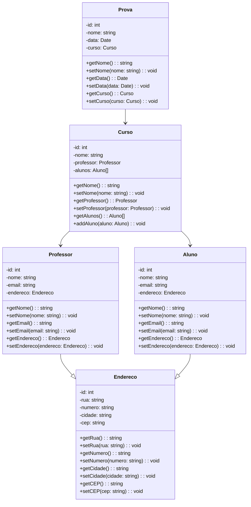

# EscolaOn
Sistema para prova online

```mermaid (exemplo de classe com relacionamento)  
classDiagram
  class Professor {
    -id: int
    -nome: string
    -email: string
    -endereco: Endereco
    +getNome(): string
    +setNome(nome: string): void
    +getEmail(): string
    +setEmail(email: string): void
    +getEndereco(): Endereco
    +setEndereco(endereco: Endereco): void
  }

  class Aluno {
    -id: int
    -nome: string
    -email: string
    -endereco: Endereco
    +getNome(): string
    +setNome(nome: string): void
    +getEmail(): string
    +setEmail(email: string): void
    +getEndereco(): Endereco
    +setEndereco(endereco: Endereco): void
  }

  class Curso {
    -id: int
    -nome: string
    -professor: Professor
    -alunos: Aluno[]
    +getNome(): string
    +setNome(nome: string): void
    +getProfessor(): Professor
    +setProfessor(professor: Professor): void
    +getAlunos(): Aluno[]
    +addAluno(aluno: Aluno): void
  }

  class Prova {
    -id: int
    -nome: string
    -data: Date
    -curso: Curso
    +getNome(): string
    +setNome(nome: string): void
    +getData(): Date
    +setData(data: Date): void
    +getCurso(): Curso
    +setCurso(curso: Curso): void
  }

  class Endereco {
    -id: int
    -rua: string
    -numero: string
    -cidade: string
    -cep: string
    +getRua(): string
    +setRua(rua: string): void
    +getNumero(): string
    +setNumero(numero: string): void
    +getCidade(): string
    +setCidade(cidade: string): void
    +getCEP(): string
    +setCEP(cep: string): void
  }

  Professor --|> Endereco
  Aluno --|> Endereco
  Curso --> Professor
  Curso --> Aluno
  Prova --> Curso
```
